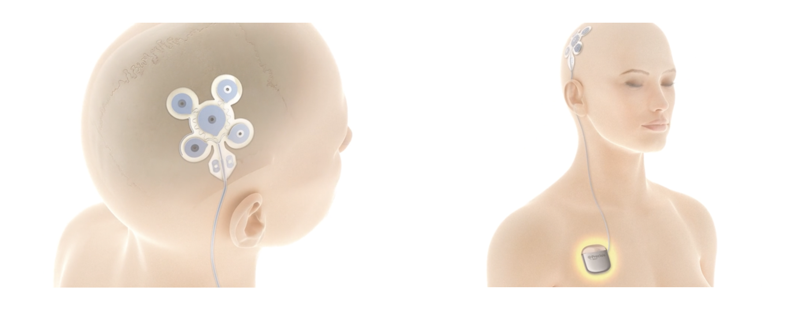

Für Patienten, die unter medikamentöser Behandlung nicht anfallsfrei sind, gibt es eine neue Behandlungsoption – die „**F**okale **C**ortex**s**timulation“, abgekürzt FCS. In diesem Artikel beantwortet *Prof. Dr. med. Andreas Schulze-Bonhage*, ärztlicher Leiter des Epilepsiezentrums Freiburg, kurz die wichtigsten Fragen zu diesem Thema. 

**Was bedeutet Fokale Cortexstimulation?**\
Fokale Cortexstimulation bedeutet, dass die Hirnrinde (lateinisch Cortex cerebri) in einem umschriebenen Areal („fokal“) elektrisch gereizt wird („Stimulation“). Hierbei wird eine Elektrode zur Gabe der elektrischen Ströme unter der Haut auf dem Schädel in der Region eines epileptischen Herdes angebracht. Die gewählten Stromstärken zur Reizung sind dabei so gering, dass sie nicht wahrgenommen werden können. Dennoch weiß man aus Berechnungen der elektrischen Feldstärken, dass die Reizung Nervenzellen beeinflussen kann, so dass diese seltener entladen und damit die Ausbildung epileptischer, hochfrequenter Entladungen weniger unterstützen.

**Wie wirkt sich die Fokale Cortexstimulation aus?**\
Im April wurden die Ergebnisse zweier klinischer Studien veröffentlicht, bei denen Patienten mit einer medikamentös nicht zufriedenstellend behandelbaren fokalen Epilepsie für einen Zeitraum von 6 Monaten mit fokaler Cortexstimulation behandelt wurden. Nach 6 Monaten war die Anfallshäufigkeit bei der Hälfte der behandelten Patienten um 50% geringer, ein Viertel der behandelten Patienten hatte sogar eine Anfallsreduktion um mindestens 75%. Aufgrund dieser Effektivität wurde das System mit dem Namen EASEE zur Behandlung fokaler Epilepsien zugelassen.

**Wie kann man sich das Gerät vorstellen?**\
Das Gerät besteht aus einem Stimulator, der im Brustbereich unter der Haut eingepflanzt wird, und aus einer Elektrode, die unter der Kopfhaut über der Hirnregion angebracht wird, von welcher die epileptischen Anfälle ausgehen. Die Elektrode ist sehr dünn und kann von außen nicht gesehen, sowie ertastet werden. Sie hat eine spezielle Elektrodenanordnung, die es ermöglicht, dass die elektrischen Ströme von außen durch den Schädel hindurch wirksam werden können. Der Stimulator ist mit der Elektrode durch ein Kabel, welches unter der Haut liegt, verbunden und liefert die nötige elektrische Energie (siehe Abbildung).

**Beinhaltet die Einpflanzung der Elektrode Risiken?**\
Die Einpflanzung erfolgt unter Narkose und wird nicht bewusst erlebt. An der Stelle, wo die Haut geöffnet wird, kann es in den nachfolgenden Tagen zu einem Kribbelgefühl oder Taubheitsgefühl kommen, die im Verlauf der ersten Woche in aller Regel nachlassen. Grundsätzlich kann es an der Stelle, wo die Elektrode implantiert wurde, zu einer kleinen Blutung oder Infektion kommen. Es ist davon auszugehen, dass die FCS aktuell das am wenigsten riskante Stimulationsverfahren bei fokalen Epilepsien ist. Insbesondere im Vergleich zu Verfahren einer direkten Hirnreizung über in den Schädel implantierte Elektroden, deren Einpflanzung in seltenen Fällen intrakranielle Gefäße schädigen und im schlimmsten Fall zu einer Hirnblutung führen kann. Die elektrische Stimulation selbst wurde bislang von allen Patienten gut vertragen.

**Bei wem kann die Fokale Cortexstimulation eingesetzt werden?**\
Die elektrische Reizung erfolgt über einem epileptogenen Areal. Daher können nur Patienten, welche einen umschriebenen Anfallsursprung (eine „fokale Epilepsie“) haben, mit dem EASEE-Stimulator behandelt werden. Bislang wurden solche Patienten behandelt, deren Anfallsursprung aus einer Region kam, die in der Nähe zum Schädelknochen lag. Es ist noch nicht bekannt, ob auch Patienten mit einem tieferliegenden epileptischen Herd ebenso von der Behandlung profitieren können.

**Nimmt man die Medikamente weiterhin ein?**\
Die Medikation wird auch unter der Stimulationsbehandlung weiterhin eingenommen. Aktuell wird untersucht, ob im Langzeitverlauf bei guter Wirksamkeit der FCS weniger Medikamente eingenommen werden müssen. 

**Wer kann die Fokale Cortexstimulation verordnen?**\
Als zugelassenes Behandlungsverfahren kann die FCS im Prinzip von jedem Neurologen verschrieben und kann in jedem Krankenhaus eingesetzt werden. Gerade in der Anfangsphase der Einführung werden jedoch hauptsächlich Epilepsiezentren die Indikation stellen.

\|Unbezahlte Werbung